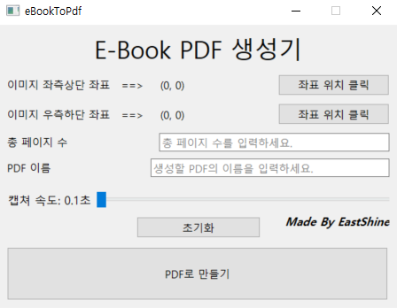

# ebook_scanner

전자책 뷰어의 지정 영역을 페이지 단위로 캡처하고, 캡처 이미지를 하나의 PDF로 묶어주는 Windows용 GUI 프로그램입니다.



## 기능

- 마우스 클릭으로 캡처 영역의 좌측상단/우측하단 좌표 지정
- 총 페이지 수, PDF 이름, 저장 폴더 설정
- 페이지 렌더링 속도에 맞춘 캡처 간격과 시작 대기 시간 조절
- 오른쪽/왼쪽/위/아래/스페이스/Page Down 페이지 넘김 키 선택
- 시작 전 전자책 뷰어 포커스 자동 클릭 옵션
- 캡처 및 PDF 변환 진행률 표시
- 실행 중 작업 중지
- PDF 생성 후 캡처 이미지 자동 삭제 또는 보관 선택
- 기존 PDF 덮어쓰기 확인
- GUI가 멈추지 않도록 백그라운드 스레드에서 캡처 및 변환
- Windows 파일명에 맞춘 PDF 이름 정리

## 설치

```powershell
git clone https://github.com/deploy103/ebook_scanner.git
cd ebook_scanner
python -m venv .venv
.\.venv\Scripts\activate
pip install -e .
```

Python 3.10 이상이 필요합니다.

## 실행

```powershell
ebook-to-pdf
```

또는 소스에서 바로 실행할 수 있습니다.

```powershell
python -m ebook_to_pdf
```

## 사용 순서

1. 전자책 뷰어를 열고 첫 페이지가 보이도록 둡니다.
2. `좌측상단 좌표 클릭`을 누른 뒤 캡처할 영역의 왼쪽 위 모서리를 클릭합니다.
3. `우측하단 좌표 클릭`을 누른 뒤 캡처할 영역의 오른쪽 아래 모서리를 클릭합니다.
4. `총 페이지 수`, `PDF 이름`, `저장 폴더`를 입력합니다.
5. 페이지가 완전히 렌더링되는 시간을 보고 `캡처 간격`을 조절합니다.
6. 뷰어에서 다음 페이지로 넘어가는 키를 `페이지 넘김 키`에서 선택합니다.
7. `PDF로 만들기`를 누르고 완료 메시지가 뜰 때까지 기다립니다.

## 주의사항

1. Windows 데스크톱 환경에서 사용하는 것을 기준으로 합니다.
2. 캡처 영역은 반드시 전자책 뷰어의 페이지 표시 영역 안에 있어야 합니다.
3. 선택한 `페이지 넘김 키`로 뷰어가 다음 페이지로 이동해야 합니다.
4. 페이지 렌더링이 느리면 `캡처 간격`을 늘려야 누락이나 중복 캡처가 줄어듭니다.
5. 페이지 수가 많으면 PDF 생성 시간이 길고 파일 크기가 커질 수 있습니다.
6. 프로그램 창이 캡처 영역을 가리지 않도록 옆으로 옮겨두세요.
7. 본인이 열람/백업할 권한이 있는 문서에만 사용하세요.

## 개발

```powershell
pip install -e .
python -m unittest discover -s tests
```

## 라이선스

MIT
